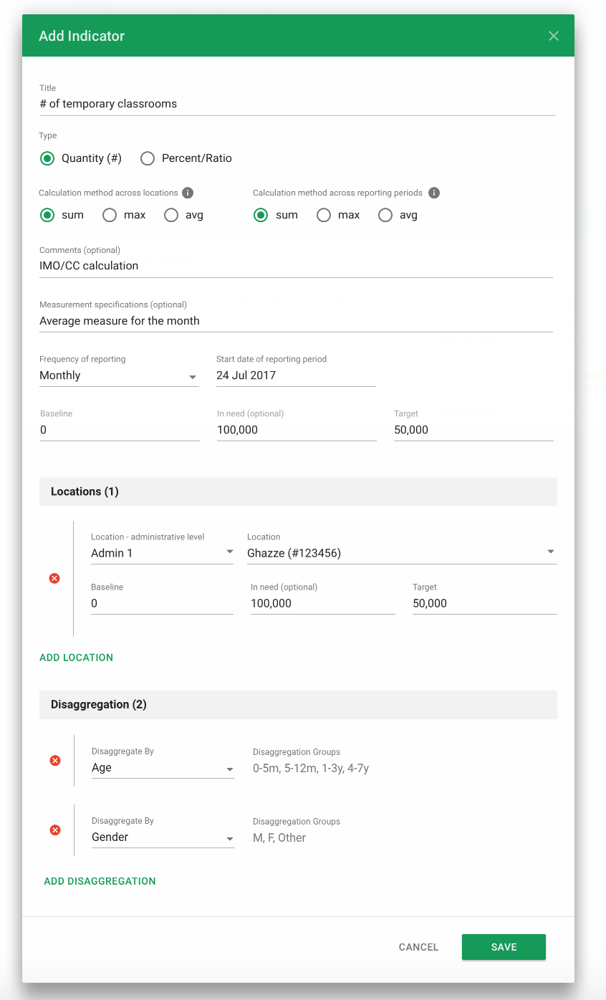
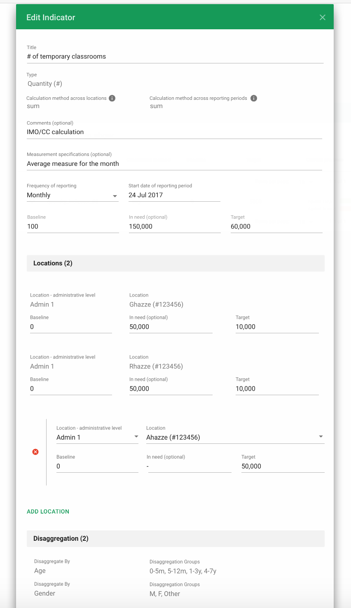
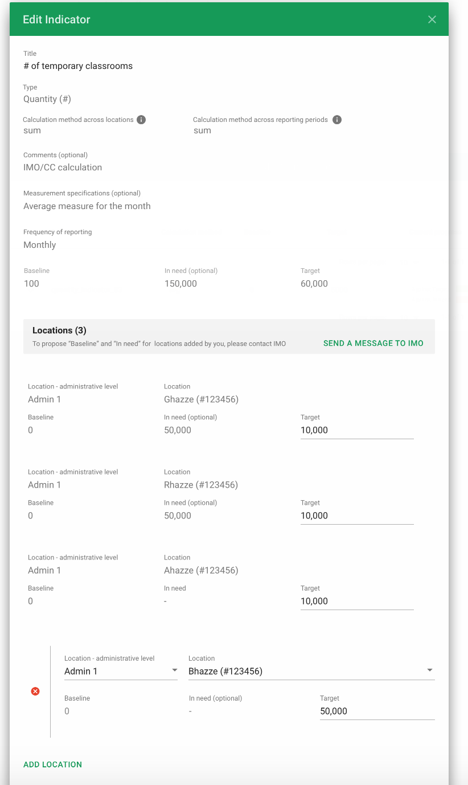
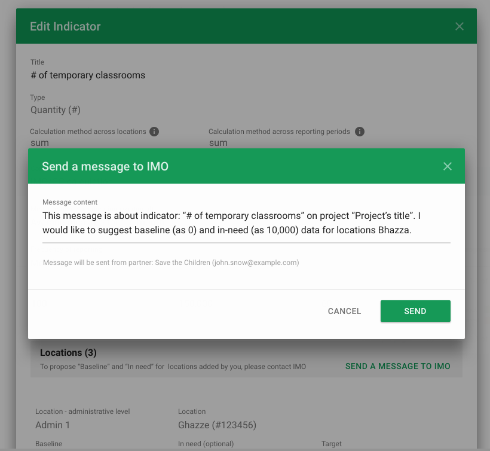
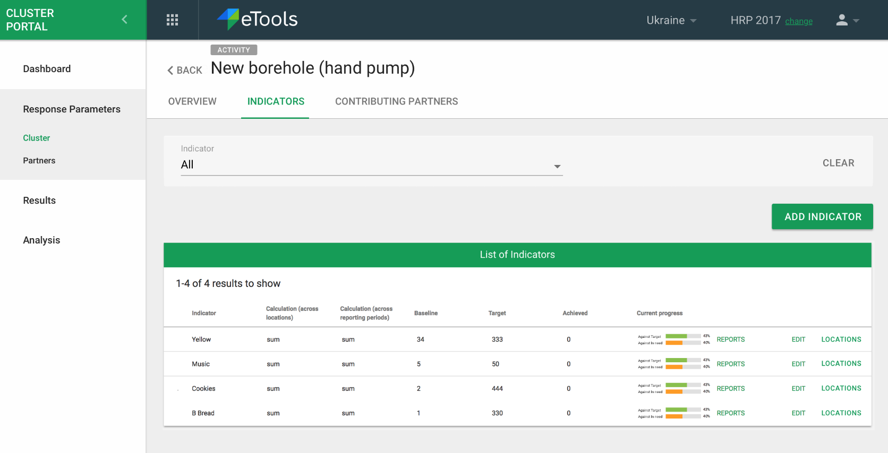
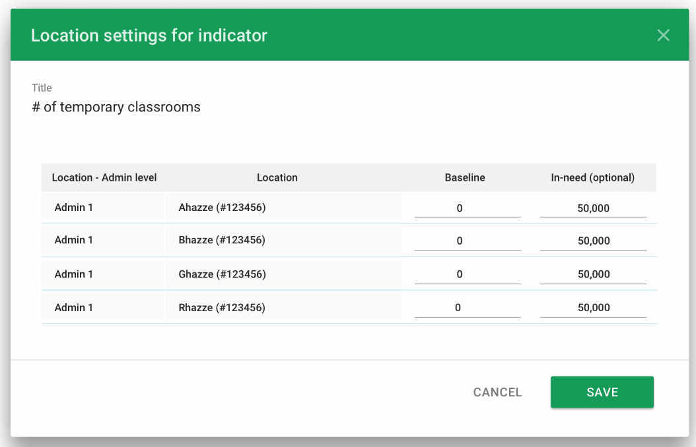

# Cluster Indicators

Indicators in a cluster can belong to following entities:

* Cluster Objective
* Cluster Activity
* Partner Project
* Project Activity: Either one of these
  * Custom
  * Associated with Cluster activity

### Add Indicator Modal

IMOs and partners can create their own indicators. They can choose the type of indicator and calculation method for reporting periods/locations.

IMO's set baseline, target at the indicator level. If this is a Partner indicator, they can set these too. In-need is an optional. If baseline is not set, it default's to 0.

At the location level, IMO can set the admin level and  specific location pertaining to the level. In-need is optional to set here. IMOs can add multiple locations and disaggregations too.

 

IMO or Partner can edit an indicator. The location admin level and specific location previously set are not editable. Locations can be added though.

Partners can adopt Activity Indicators previously set by the IMO. They are able to edit the target and add locations. If the partner adds a location, they will be able to include the administration level, specific location for the level and target. 

If the Partner would like to propose a new Baseline and in-need to the IMO, they can send a direct message to the IMO. This will be sent to the IMO's email.

### Showing Current Progress against Target and against In-Need

In the Indicator Reports, users will be able to see the current progress against Target and In-Need.

IMOs will be able to enter new baseline and In-Need for specific locations in bulk. In-need is optional and Baseline defaults to 0.

### Helper Text &lt;TBD&gt;

When looking at an indicator, the user can click on the 'i' for helper text.

