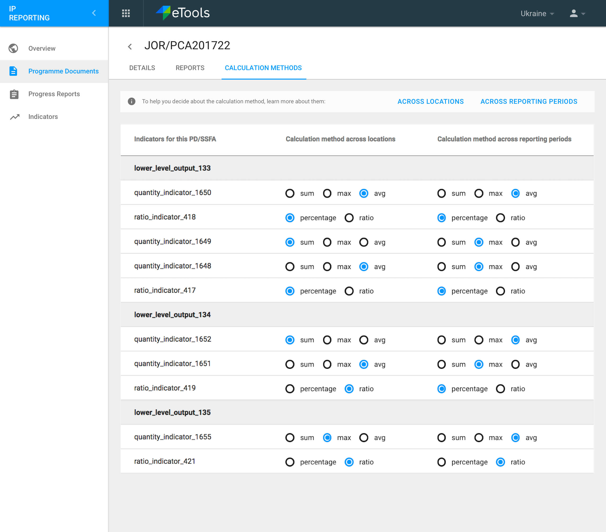
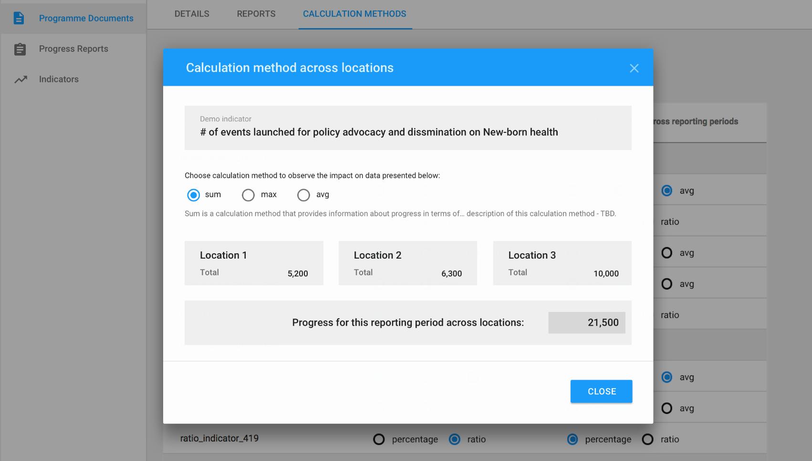
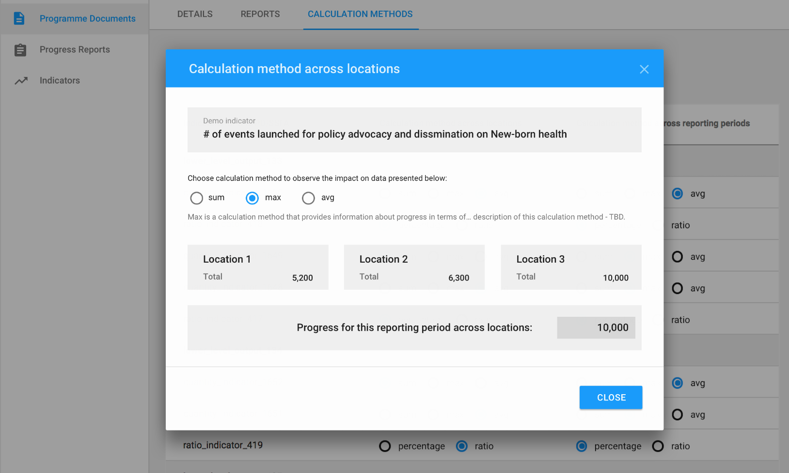
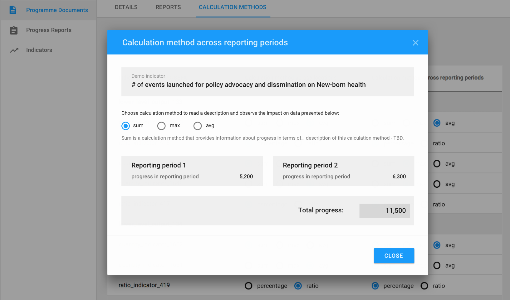
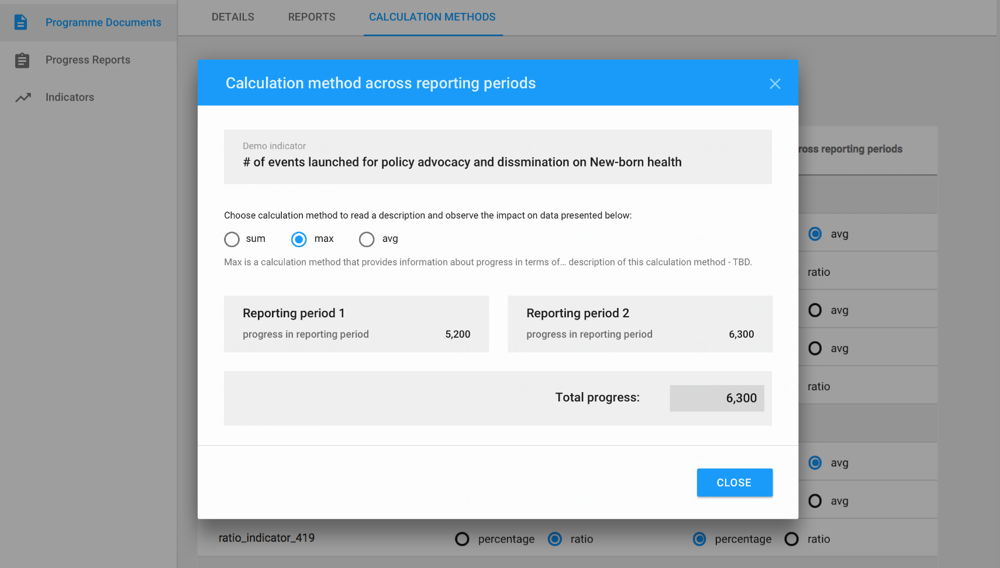

# Setting calculation methods for indicators

The IP can set the appropriate calculation method for each indicator in a PD. See screenshot below:

### Supported calculation methods

The following calculation methods are supported:

* Sum - simply adds data.
* Avg - The average of the data.
* Max - The maximum value in the period being looked at.

### Calculation method across locations

This represents how the IP would like to aggregate the data entered for all the locations in an indicator. Once applied this helps measure the total progress made on an indicator in a reporting period.

### Calculation method across reporting periods

This represents how the IP would like to aggregate the data entered across various reporting periods. This is what decides what progress has been made on an indicator at any given point of time.

The calculation method in this case is applied to the total progress made on an indicator in a reporting period \(not location level data at all\).

### Demo indicator table

When the IP user goes to set calculation methods, we will enable the user to be able to understand the impact their calculation method selection will have, by showing the user some example numbers / data for an example indicator.

